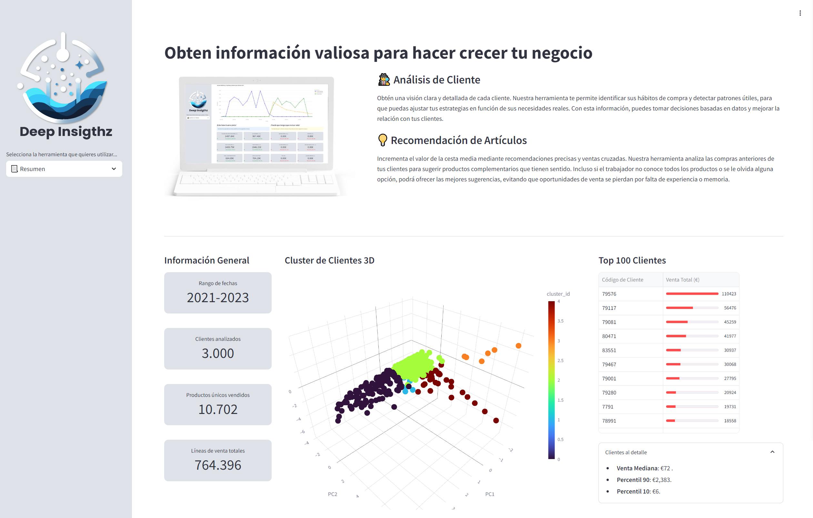

# **Deep Insightz - Proyecto de Ciencia de Datos**

🖥️ [**Enlace a la web del proyecto**](https://huggingface.co/spaces/GMARTINEZMILLA/Final_Project) 🖥️

---

## **📂 Organización del Proyecto**

El proyecto ha sido organizado de manera modular para facilitar su mantenimiento y escalabilidad, distribuyéndolo en tres plataformas principales:

1. **GitHub**: Aquí se encuentra el código fuente del proyecto, incluyendo los **Jupyter Notebooks** que documentan cada etapa del desarrollo. Dentro de la carpeta `src/`, hemos organizado el contenido en distintas subcarpetas, cada una correspondiente a un paso clave del proyecto, como la limpieza de datos, preparación de datos para LightGBM, y los análisis de clustering.

   - **Estructura de carpetas dentro de `src/`**:
     - `limpieza_de_datos/`: Incluye los notebooks y scripts utilizados para limpiar y preparar los datos iniciales.
     - `clustering/`: Contiene los notebooks relacionados con la segmentación de clientes utilizando técnicas de clustering.
     - `lightGBM_preparation/`: Aquí están los notebooks para preparar los datos necesarios para entrenar el modelo con **LightGBM**.
     - `recomendacion_productos/`: Almacena los notebooks relacionados con el sistema de recomendación de artículos.

2. **Google Drive**: Debido al tamaño considerable de los archivos de datos (.csv), utilizamos Google Drive para almacenar y gestionar los datasets utilizados en el proyecto. Los archivos CSV son demasiado grandes para ser almacenados directamente en GitHub, por lo que se acceden a ellos directamente desde Google Drive.

   - **Archivos clave en Google Drive**:
     - `ventas_clientes.csv`: Contiene los datos históricos de ventas por cliente.
     - `productos.csv`: Listado completo de productos disponibles.
     - `cestas.csv`: Almacena los datos históricos de cestas de compra utilizadas para el sistema de recomendación.
   
3. **Hugging Face Spaces**: La aplicación web que integra el análisis de clientes y las recomendaciones de productos está desplegada en **Hugging Face Spaces**. Esta plataforma facilita la visualización y uso de las herramientas desarrolladas, permitiendo a los usuarios interactuar con el modelo de predicción y el sistema de recomendación.

   - **Características principales de la app en Hugging Face**:
     - **Análisis de Clientes**: Visualización de las predicciones de ventas por fabricante para cada cliente, junto con una comparativa de los resultados reales.
     - **Recomendación de Productos**: Sugerencias automáticas de productos complementarios basadas en las cestas de compra anteriores de los clientes.

Con esta organización, podemos mantener un flujo de trabajo ágil, asegurando que los datos y los scripts estén bien gestionados y accesibles para todo el equipo.

---

## **💻 Funciones de la app**

Nuestra web incluye dos herramientas clave:

1. **Análisis de Clientes**: Predicción de ventas por fabricante, ayudando a los equipos de ventas a tomar decisiones basadas en datos.
2. **Recomendación de Artículos**: Sugiere productos complementarios basados en cestas de compra anteriores de los clientes.

---

## **🚨 Problemas Identificados**
 ### 🚩Primer Problema Identificado:
 Hemos detectado una **falta de herramientas** que permitan a los comerciales **analizar de manera eficiente el comportamiento de compra de sus clientes B2B** (aproximadamente 4.000). 
 El análisis que realiza la empresa actualmente, se centra en las ventas anuales de los mejores clientes, **limitando la identificación de oportunidades de crecimiento** entre el resto de sus clientes, además de reducir el potencial de intervención en decisiones clave.
 ### Retos clave:
 - **Detección de cambios en los hábitos de compra**: Si un cliente modifica sus hábitos de compra o deja de adquirir productos de una marca en particular, resulta difícil detectar estos cambios sin un análisis detallado. Por ejemplo, un cliente que deja de comprar platos de ducha de nuestra empresa para adquirirlos de un competidor podría, al mismo tiempo, aumentar las compras de otros productos debido al crecimiento de su negocio. Este cambio mantendría el volumen global de ventas estable y pasaría inadvertido, representando así una oportunidad de venta perdida.
 - **Saturación de información**: Los comerciales gestionan una amplia cartera de clientes y pedidos, lo que les dificulta analizar a fondo el comportamiento individual de cada cliente. Esto resulta en una pérdida de oportunidades estratégicas, ya que, debido a la gran variedad de productos, es probable que terminen ofreciendo opciones que no se ajustan a las necesidades o intereses específicos del cliente.
 - **Acceso limitado a la información clave**: Los vendedores no disponen de acceso completo a la información de sus clientes, lo que les impide realizar análisis detallados sin depender de la colaboración de personas autorizadas. Esta situación genera cuellos de botella y retrasa la toma de decisiones, reduciendo la agilidad en la atención y respuesta a las necesidades de los clientes.
 ### 🚩Segundo Problema Identificado:
 La empresa de fontanería enfrenta un desafío significativo en la gestión de su extenso catálogo de productos. Aunque en los datos analizados se detectaron 10.000 productos únicos, la base de datos de la empresa contiene 40.000 artículos registrados. Esta enorme cantidad de artículos obliga a la empresa a depender del conocimiento y experiencia de sus trabajadores para ofrecer productos relevantes a los clientes.
 ### Retos clave:
 - **Catálogo Extenso y Complejo**: El aprendizaje suele ocurrir sobre la marcha, conforme el trabajador se enfrenta a preguntas de los clientes o recibe formación de la empresa, además de su propio interés en aprender.
 - **Expectativas de Rapidez**: Los clientes profesionales, **esperan pasar el menor tiempo posible en la tienda**. Por esta razón, los trabajadores tienen que operar a un ritmo rápido, lo que genera situaciones en las que, por falta de tiempo, los empleados pueden olvidar sugerir productos complementarios que podrían incrementar el valor de la cesta, además de **evitarle al cliente un viaje de vuelta a la tienda**.
 - **Tiempo limitado**: Los trabajadores con experiencia suelen estar **muy ocupados atendiendo a sus propios clientes**, lo que deja poco tiempo para ayudar a los nuevos empleados a familiarizarse con el catálogo. Esta situación es especialmente difícil en **momentos de alta demanda**, donde **no es posible dejar de atender a los clientes** para apoyar a los trabajadores nuevos en la recomendación de productos.
 

---

## **🛠 Soluciones Propuestas**

### 1. **🕵️ Análisis de Clientes**
Para abordar la falta de herramientas que permita a los comerciales analizar eficazmente el comportamiento de compra de los clientes, hemos desarrollado la herramienta de Análisis de Cliente. Esta solución proporciona una visión clara de las ventas por fabricante para cada cliente, facilitando la detección de cambios en los hábitos de compra. Al mostrar las predicciones de ventas futuras, comparadas con los resultados reales, los comerciales pueden identificar rápidamente si un cliente ha dejado de adquirir productos de una marca específica y así poder tomar medidas preventivas o correctivas.

Además, la herramienta **simplifica la gestión de información**, en lugar de tener que solicitar datos o realizar análisis manuales, ofrece una visión global del cliente, permitiendo a los comerciales revisar de un vistazo sus preferencias y tendencias de compra. Esto agiliza la toma de decisiones y mejora la capacidad de respuesta ante las necesidades del cliente.

### 2. **💡 Recomendación de Artículos**
La herramienta de Recomendación de Artículos permite a los vendedores sugerir productos complementarios basados en las compras realizadas por todos los clientes. Esto **facilita la venta cruzada**, incluso en situaciones donde el trabajador **no está familiarizado con todo el catálogo de productos**, ya que la herramienta sugiere opciones relevantes de manera automática.

Además, esta solución optimiza el tiempo en tienda al proporcionar recomendaciones rápidas, evitando que el cliente tenga que volver por productos que podrían haber olvidado. De esta manera, se mejora la experiencia de compra y se incrementa el valor de la cesta, ayudando a maximizar las oportunidades de venta sin aumentar la carga de trabajo del vendedor.

---

## **📊 Recolección y preparación de datos**
Los datos utilizados en este proyecto provienen de los albaranes de compra históricos de los clientes B2B de la empresa, que nos entregaron con la información de los clientes codificada. A continuación, se describen los pasos más relevantes en el proceso de limpieza y preparación de los datos:

- **Corrección de errores en los códigos**: Durante la exportación, algunos códigos numéricos se transformaron en notación científica (ej. '09E+12'), lo que requirió ajustar la forma en que se exportaron. También se solucionaron errores en los caracteres, como la sustitución incorrecta de la letra "Ñ".
- **Eliminación de datos irrelevantes**: Se eliminaron instancias con artículos nulos o descripciones erróneas (como aquellas que contenían "DSCTL"). También se neutralizaron los productos devueltos, descartando las devoluciones donde no hubo compras desde 2021.
- **Generación de nuevos campos**: Se crearon identificadores únicos de facturas combinando serie y número. Asimismo, se calculó la frecuencia anual de compra y el total de ventas anuales por cliente para obtener una visión clara de su comportamiento.
- **Reducción del conjunto de fabricantes**: Dado que muchos fabricantes tenían ventas muy bajas, se decidió concentrar los análisis en los 99 fabricantes más relevantes, aquellos con más de 1.000 artículos vendidos en los últimos 4 años.
- **Enriquecimiento de datos**: Se añadieron columnas que incluyen el grupo de productos y las categorías de clientes previamente definidas por la empresa (plomero, electricista, constructor, etc.).

---

## **🔍 Datos Clave del Dataset**
El análisis del dataset reveló algunos aspectos importantes sobre los clientes y sus patrones de compra. A continuación, se destacan algunos puntos clave:
- **Volumen de datos**: El dataset utilizado contiene un total de 764,396 líneas de ventas distribuidas entre 4.000 clientes B2B y 99 fabricantes seleccionados, lo que representa una reducción de los más de 300 fabricantes originalmente presentes en los datos.
- **Preferencias de Fabricantes**: Un pequeño porcentaje de fabricantes domina las ventas. Por ejemplo, el 20% de los fabricantes más vendidos representan el 80% de las ventas totales. Esto nos permitió concentrarnos en los fabricantes con más relevancia, asegurando que las recomendaciones y predicciones fueran más precisas.
- **Distribución de Compras por Cliente**: Se detectaron diferencias marcadas en el comportamiento de compra de los clientes. Mientras que el 90% de los clientes compraron menos de 1.000 artículos en total, un 10% de los clientes son responsables de las compras de más de 10.000 artículos, representando a los clientes más valiosos.
- **Frecuencia de Compra**: Los clientes tienen patrones de compra variados, desde compras regulares y estables a lo largo del tiempo, hasta clientes que compran de manera intermitente. Identificamos que aproximadamente el 10% de los clientes realizan compras significativas con frecuencia, lo que refuerza la importancia de segmentar correctamente las estrategias de venta.

---

## **⚙️ Algoritmos y Métricas Utilizadas**
### 1. **🕵️ Análisis de Clientes**
- **Algoritmo**: Se utilizó **LightGBM** para las predicciones, por su eficiencia al manejar grandes cantidades de datos con muchos valores cero.

En nuestro caso, la empresa cuenta con una extensa base de datos que incluye una gran cantidad de fabricantes y clientes, muchos de los cuales tienen ventas irregulares o incluso nulas. LightGBM es **particularmente adecuado en situaciones donde los datos contienen muchos valores cero**, ya que implementa técnicas de optimización como el histograma de reducción de precisión. Esto le permite realizar cálculos más rápidos y reducir el consumo de memoria sin sacrificar la precisión. Además, LightGBM es **altamente eficiente en la gestión de grandes datasets con una gran cantidad de variables categóricas**, como los distintos fabricantes. Su capacidad para tratar datos dispersos (sparse data) y manejar valores faltantes automáticamente también nos resultó crucial en este proyecto, dado que el comportamiento de compra de los clientes puede variar significativamente según el fabricante y el período.

- **Métricas de Evaluación**: 
  - **MAE** (Mean Absolute Error)
El MAE mide el error medio absoluto entre las predicciones y los valores reales. 
Simplemente toma la diferencia absoluta entre ambos y luego calcula el promedio. 
Es fácil de entender, ya que nos dice cuántas unidades (en promedio) nos hemos desviado de los valores reales.

**Ejemplo**: 
Si predecimos que un cliente comprará 200 unidades y realmente compra 220, la diferencia absoluta es 20 unidades. 
Si repetimos esto para varios clientes y obtenemos diferencias como 10, 15, y 25, el MAE sería el promedio de esas diferencias, 
es decir, (20 + 10 + 15 + 25) / 4 = 17.5 unidades.

  - **RMSE** (Root Mean Square Error)
El RMSE también mide la diferencia entre los valores reales y predichos, pero penaliza más los errores grandes. 
Esto se logra elevando al cuadrado las diferencias antes de hacer la media y tomando la raíz cuadrada del resultado.

**Ejemplo**: 
Si tenemos las mismas diferencias que antes (20, 10, 15, 25), elevamos cada una al cuadrado: 400, 100, 225, 625. 
Luego, calculamos el promedio de estos números: (400 + 100 + 225 + 625) / 4 = 337.5. 
Finalmente, tomamos la raíz cuadrada, obteniendo un RMSE de aproximadamente 18.37 unidades. 
Este valor es más sensible a las grandes diferencias.

  - **SMAPE** (Symmetric Mean Absolute Percentage Error)

El SMAPE es una métrica que se utiliza para medir la precisión de los modelos de predicción. Es una variación del MAPE (Mean Absolute Percentage Error), diseñada para evitar los problemas que surgen cuando los valores reales son muy pequeños o cercanos a cero. A diferencia del MAPE, que puede volverse inestable en estas situaciones, el SMAPE es más robusto y proporciona una mejor representación de los errores de predicción.

**Ejemplo**:
Cuando tenemos valores cercanos a 0, el MAPE se puede ir a infinito.
En este ejemplo, predecimos que se venderían 5 unidades y se venden 0. Aquí el MAPE se vuelve problemático:

En este caso, el SMAPE devuelve un valor finito y más razonable, lo que lo hace más adecuado cuando se trata de valores cercanos a cero. En comparación, el MAPE, incluso si le asignamos un valor muy pequeño, puede generar un porcentaje extremadamente alto. Dado que en nuestro proyecto es probable que encontremos escenarios con valores cercanos a cero, el SMAPE nos permite evaluar de manera más precisa la efectividad de las predicciones.

### 2. **💡 Recomendación de Artículos**

- **Algoritmo**: Para generar recomendaciones de productos complementarios, implementamos un enfoque basado en la similitud de cestas de compra utilizando **TF-IDF** y **cosine similarity**. Este método analiza las cestas de compra históricas y calcula la relevancia de cada artículo en relación con las compras anteriores del cliente. Para ello, usamos un modelo basado en la frecuencia de términos (**Term Frequency - TF**), donde cada cesta se convierte en una representación de los productos comprados. Esto nos permite comparar la nueva cesta con otras cestas similares y recomendar productos adicionales que aún no han sido añadidos por el cliente.

En nuestro proyecto, utilizamos esta técnica porque:

- Es eficiente al manejar grandes cantidades de datos de productos y cestas.
- Permite generar recomendaciones basadas en datos históricos sin depender de un conocimiento exhaustivo del catálogo por parte de los trabajadores.
- Mejora las oportunidades de venta cruzada, facilitando la sugerencia automática de productos relevantes.

**Cómo funciona el sistema de recomendaciones**: El algoritmo toma la cesta de compra actual del cliente y la compara con todas las cestas de compra históricas utilizando el **cosine similarity**, que mide la similitud entre dos vectores. A partir de las cestas más similares, sugiere productos adicionales que no están en la cesta actual, priorizando aquellos que tienen una mayor relevancia en las cestas comparadas.

---

## **🚀 Mejoras Futuras**

### **1. Entrenamiento Continuo del Modelo de 🕵️ Análisis de Clientes**

El uso de **LightGBM** en este proyecto es fundamental para mantener la precisión de las predicciones de ventas de los clientes a lo largo del tiempo. Dado que los datos de ventas son dinámicos, necesitamos actualizar periódicamente el modelo sin la necesidad de entrenarlo completamente desde cero. Esto se logra mediante **entrenamiento incremental**, una característica que permite **añadir nuevos datos** sin reentrenar el modelo por completo.

#### **Propuesta de Actualización**

El enfoque que se propone es **actualizar el modelo cada dos o tres meses** con los datos más recientes, manteniendo siempre un retraso deliberado en el entrenamiento. Esto nos permite comparar las **predicciones hechas previamente** para un mes determinado con los **resultados reales** una vez que esos datos estén disponibles. El flujo sería el siguiente:

1. **Entrenamiento inicial**: El modelo se entrena con todos los datos históricos disponibles hasta el mes "X".
2. **Predicción futura**: Se generan predicciones para los meses **X+1**, **X+2**, y así sucesivamente.
3. **Retraso intencionado**: Dos meses después (por ejemplo, en el mes "X+2"), obtenemos los datos reales del mes **X+1**. En ese momento, se compara la predicción de ese mes con los resultados reales.
4. **Reentrenamiento incremental**: Usamos los nuevos datos de los meses **X+1** y **X+2** para actualizar el modelo **sin necesidad de reentrenar completamente**. Esto se hace utilizando la capacidad de LightGBM de añadir nuevos datos a un modelo previamente entrenado, mediante su parámetro `init_model`, que permite reanudar el entrenamiento desde donde se dejó.

#### **Ventajas del Entrenamiento Incremental**

1. **Eficiencia de Recursos**: Este enfoque evita reentrenar todo el modelo desde cero, lo que ahorra significativamente tiempo de computación y recursos. Solo se entrena con los nuevos datos, ajustando el modelo existente.

2. **Adaptación a Cambios Rápidos**: A medida que los hábitos de compra de los clientes cambian, el modelo puede actualizarse regularmente para reflejar estos cambios y mejorar las predicciones.

3. **Comparación Constante**: Al comparar las predicciones hechas con los datos reales mes a mes, podemos ajustar los hiperparámetros o modificar el modelo para mejorar su precisión.

Este enfoque asegura que el modelo se mantenga **actualizado** y **preciso** sin interrumpir las operaciones ni generar altos costos computacionales, maximizando la capacidad de predicción con un proceso optimizado.

### **2. Mejora Continua del Sistema de 💡 Recomendación de Artículos**

El sistema de recomendación de cestas de compra se basa en la similitud de cestas anteriores mediante el uso de **TF-IDF** y **cosine similarity**, lo que permite sugerir productos complementarios basados en las compras históricas de los clientes. A pesar de ser eficaz, este enfoque tiene una limitación: **no recomendará productos que los clientes nunca han comprado antes**, lo que puede dejar fuera artículos relevantes que podrían incrementar las ventas.

#### **Retroalimentación Manual**

Para evitar este problema, añadimos la opción de generar cestas de forma manual, de esta manera, si la empresa detecta un producto que debería recomendarse y que los clientes no lo compran porque lo desconocen, podrán generar las cestas necesarias para que el programa entienda que ese producto se debe recomendar junto a otros.

1. **Actualización automática del modelo**: A medida que se añadan nuevas cestas al sistema, estas serán automáticamente integradas en la matriz **TF-IDF** y podrán influir en las recomendaciones futuras.

2. **Incorporación de cestas definidas manualmente**: Los expertos podrán crear **cestas predefinidas** que incluyan productos que el cliente podría desconocer, pero que son cruciales para completar una venta (por ejemplo, herramientas especializadas que no siempre se compran junto con los productos principales, pero que son necesarias para su instalación). Al permitir que estos productos se **recomienden manualmente**, evitamos que el modelo dependa únicamente de la historia de compra del cliente.

#### **Implementación Técnica**

Técnicamente, esta retroalimentación se gestionará mediante la función **retroalimentacion**, que ya permite añadir nuevas cestas al historial, reentrenar la matriz de términos y ajustar el sistema de recomendaciones en base a estos cambios. De esta forma, se actualiza la representación **TF-IDF** para reflejar tanto las nuevas cestas históricas como las manuales, asegurando que el modelo **no pierda efectividad** con el tiempo.

#### **Retroalimentación Automática**

Para mejorar el sistema de manera automática, cada vez que se añadan nuevas cestas de compra, el sistema actualizará automáticamente la matriz **TF-IDF** con los datos recientes. Esto permite que las nuevas tendencias de compra de los clientes se reflejen en las recomendaciones futuras sin intervención manual.

- **Incorporación de datos recientes**: Con el tiempo, los patrones de compra pueden cambiar, ya sea por la introducción de nuevos productos o por cambios en las necesidades del cliente. A medida que estas nuevas cestas de compra se añadan al sistema, la **matriz TF-IDF** se ajustará para reflejar esos cambios, mejorando las recomendaciones basadas en tendencias más actuales.
  
- **Mejora del modelo con datos acumulados**: A medida que se acumulen más datos, el sistema podrá identificar nuevas combinaciones de productos de manera automática, sugiriendo artículos que no se habrían detectado inicialmente. Esto permite que las recomendaciones sean más precisas a medida que el sistema obtiene más información sobre el comportamiento de compra.

#### **Beneficios Combinados (Automático y Manual)**

- **Ampliación de las recomendaciones**: Se sugieren productos clave que pueden no aparecer en los registros históricos, garantizando que el sistema no dependa exclusivamente de los datos de compra previos del cliente.
  
- **Mayor control sobre las recomendaciones**: La empresa puede influir activamente en el sistema, asegurándose de destacar productos estratégicos, lanzar nuevos artículos o mejorar las combinaciones de productos.
  
- **Mejora continua del sistema**: El sistema mejora con cada nueva cesta añadida, ya que el modelo se ajusta dinámicamente con el tiempo, garantizando que las recomendaciones sigan siendo útiles y relevantes.

---

## **👥 Colaboradores**

- [**Angel Colina**](https://github.com/angel0805)
- [**Maria Ortega Rivas**](https://github.com/mariaorrri)
- [**Guillermo Martínez Millá**](https://github.com/GuillePrograma94)
